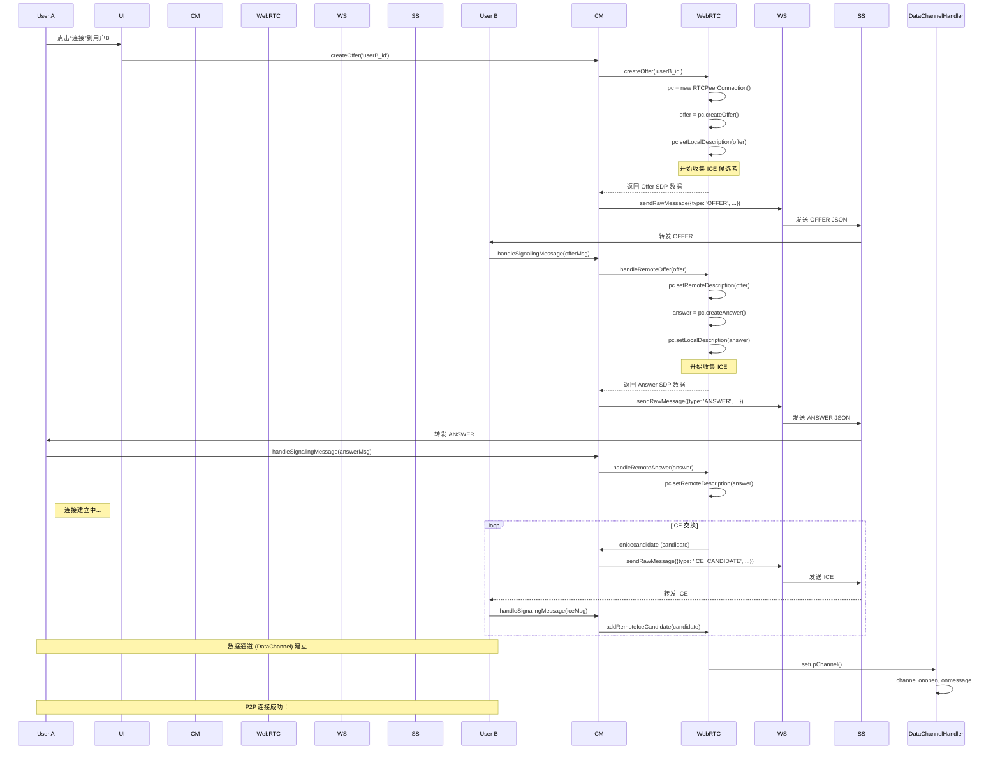

### 1. 概述

WebChat 的连接系统是一个分层架构，旨在实现健壮、灵活的实时通信。它主要依赖两种技术：

1.  **WebSocket**：用于与**信令服务器 (Signaling Server)** 的通信。它不传输用户间的聊天数据，而是扮演“中间人”的角色，负责交换建立直接连接所需的信息（如网络地址、会话描述等）。
2.  **WebRTC**：用于在用户之间建立**点对点 (Peer-to-Peer, P2P)** 连接。一旦建立，所有聊天数据（文本、文件、音视频流）都将通过这个加密的直接通道传输，无需经过服务器中转，从而实现低延迟和高私密性。

整个连接过程可以分为三种主要场景：**标准连接**（通过信令服务器）、**手动连接**（无信令服务器时的备用方案）和**自动连接**（应用启动或在线状态更新时的主动连接）。

### 2. 核心组件及其职责

理解连接流程的关键在于了解各个管理器扮演的角色：

-   **`ConnectionManager.js`**：**连接协调器 (总指挥)**。
    -   这是对外的公共 API，其他模块（如 UI 管理器）通过它发起连接。
    -   它协调 `WebSocketManager` 和 `WebRTCManager` 的工作。
    -   接收来自 `WebRTCManager` 的信令数据（Offer, Answer, ICE），并交给 `WebSocketManager` 发送。
    -   接收来自 `WebSocketManager` 的信令消息，并分发给 `WebRTCManager` 处理。
    -   提供 `isConnectedTo(peerId)` 方法，用于检查与特定对等方的连接状态。

-   **`WebSocketManager.js`**：**信令通道**。
    -   负责与信令服务器的 WebSocket 连接、断开、心跳和自动重连。
    -   它的唯一职责是透明地收发**原始信令消息 (Raw Signaling Messages)**。

-   **`WebRTCManager.js`**：**WebRTC 引擎**。
    -   管理 `RTCPeerConnection` 对象的整个生命周期。
    -   处理核心的 WebRTC 协商：创建 Offer/Answer、处理远端 SDP。
    -   处理 ICE (Interactive Connectivity Establishment) 候选者的收集和添加，这是找到 P2P 通信路径的关键。
    -   监控连接状态变化（如 `connected`, `disconnected`, `failed`）并通过 `EventEmitter` 广播事件。
    -   修复了**重新协商 (Re-negotiation)** 和**竞争条件 (Glare)** 的处理逻辑，使其更加健壮。

-   **`DataChannelHandler.js`**：**数据管道工**。
    -   一旦 `WebRTCManager` 成功建立 `RTCPeerConnection`，它就会创建或接收一个 `RTCDataChannel`。
    -   `DataChannelHandler` 负责设置此通道的 `onmessage`, `onopen`, `onclose` 事件。
    -   处理所有应用层数据的接收，包括**分片消息的重组**。现在原生支持高效的二进制文件传输。

-   **`UserManager.js`**：**身份管理者**。
    -   在收到来自未知对等方的连接请求时，会自动为其创建一个联系人记录，确保所有交互都有上下文。

-   **`PeopleLobbyManager.js`**：**在线状态雷达**。
    -   通过 API 定期从服务器获取**在线用户列表**。
    -   这是**自动连接**逻辑的关键数据来源。

-   **`AppInitializer.js`**：**启动器**。
    -   在应用启动时，调用 `ConnectionManager.initialize()` 来启动整个连接流程。

### 3. 连接场景详解

#### 场景 A：标准连接流程 (用户A -> 用户B)

这是最常见的连接方式，依赖于信令服务器。

**流程图 (Mermaid Sequence Diagram):**

**步骤分解:**

1.  **发起方 (A)**：
    -   `UI` 调用 `ConnectionManager.createOffer(B_ID)`。
    -   `ConnectionManager` 委托 `WebRTCManager` 创建一个 Offer。
    -   `WebRTCManager` 创建 `RTCPeerConnection` 实例，生成 SDP Offer，并设置为本地描述。同时开始收集本地 ICE 候选者。
    -   `WebRTCManager` 通过回调将 Offer SDP 发回给 `ConnectionManager`。
    -   `ConnectionManager` 将 Offer 包装成一个 `{type: 'OFFER', ...}` 的 JSON 消息，通过 `WebSocketManager` 发送给信令服务器。
    -   `WebRTCManager` 收集到的每个 ICE 候选者也会通过同样路径发送出去。

2.  **接收方 (B)**：
    -   `WebSocketManager` 收到来自服务器的 Offer 消息。
    -   `ConnectionManager.handleSignalingMessage` 解析消息，识别出是 `OFFER` 类型。
    -   `ConnectionManager` 委托 `WebRTCManager.handleRemoteOffer` 处理。
    -   `WebRTCManager` 创建自己的 `RTCPeerConnection`，将收到的 Offer 设置为远端描述。
    -   然后，它创建 Answer SDP，设置为本地描述，并通过 `ConnectionManager` -> `WebSocketManager` 发回给 A。
    -   同时，B 也开始收集自己的 ICE 候选者并发送给 A。

3.  **连接完成**：
    -   A 收到 B 的 Answer，通过 `WebRTCManager.handleRemoteAnswer` 设置为远端描述。
    -   双方持续交换 ICE 候选者，WebRTC 引擎会尝试所有可能的网络路径来建立连接。
    -   当一条路径成功建立，`RTCPeerConnection` 的状态变为 `connected`。
    -   `WebRTCManager` 检测到连接成功，触发 `DataChannelHandler.setupChannel`。
    -   `DataChannelHandler` 设置 `onopen`, `onmessage` 等事件。当 `onopen` 触发时，标志着 P2P 数据通道已完全准备就绪。
    -   `EventEmitter` 触发 `connectionEstablished` 事件，UI 随之更新（如显示“已连接”状态）。

#### 场景 B：手动连接流程 (信令服务器不可用)

当信令服务器故障或在 `file://` 协议下本地运行时，此流程是备用方案。

1.  **发起方 (A)**：
    -   在菜单中点击“创建连接提议”。`UI` 调用 `ConnectionManager.createOffer(null, {isManual: true})`。
    -   `WebRTCManager` 内部使用一个特殊的 `MANUAL_PLACEHOLDER_PEER_ID` 来追踪这个手动的连接。
    -   `WebRTCManager` 创建 Offer，并等待所有 ICE 候选者收集完成（或超时）。
    -   完成后，`ConnectionManager` 将包含 SDP 和所有 ICE 候选者的 JSON 字符串显示在模态框的文本区。
    -   用户 A 手动复制此文本，通过其他方式（如QQ、微信）发送给用户 B。

2.  **接收方 (B)**：
    -   用户 B 复制收到的文本，粘贴到菜单的文本区，点击“创建应答”。
    -   `ConnectionManager.createAnswer({isManual: true})` 解析 JSON，调用 `WebRTCManager.handleRemoteOffer`。
    -   `WebRTCManager` 创建 Answer，并同样等待 ICE 收集完成。
    -   完成后，包含 Answer SDP 和 ICE 的 JSON 字符串会更新到文本区。
    -   用户 B 复制此应答文本，发回给用户 A。

3.  **连接完成**：
    -   用户 A 复制收到的应答文本，粘贴到文本区，点击“接受应答”。
    -   `ConnectionManager.handleAnswer({isManual: true})` 解析 JSON，调用 `WebRTCManager.handleRemoteAnswer`。
    -   `WebRTCManager` 将 `MANUAL_PLACEHOLDER_PEER_ID` 的连接记录重命名为真实的 peerId（从应答 JSON 中获取）。
    -   连接建立，`DataChannel` 打开，流程与标准模式后续一致。

#### 场景 C：自动连接流程

此流程旨在提升用户体验，自动与在线的联系人建立连接。

1.  **触发时机**：
    -   `AppInitializer.init` 中，在用户成功注册到信令服务器后。
    -   `PeopleLobbyManager` 通过 `TimerManager` 定期（每30秒）刷新在线列表后。

2.  **执行逻辑** (`ConnectionManager.autoConnectToContacts` / `PeopleLobbyManager._handleAutoReconnectOnRefresh`)：
    -   首先，通过 `PeopleLobbyManager.fetchOnlineUsers(true)` 静默获取最新的在线用户ID列表。
    -   遍历此列表，对每个 `onlineId`：
        -   检查 `UserManager.contacts[onlineId]` 是否存在（即是否是我的联系人）。
        -   检查 `!ConnectionManager.isConnectedTo(onlineId)` 是否为 `true`（即当前没有活跃连接）。
    -   如果同时满足以上条件，则该联系人是自动连接的目标。
    -   `ConnectionManager` 会为所有目标联系人调用 `createOffer(contactId, { isSilent: true })`。`isSilent: true` 标志确保此过程不会弹出通知，除非连接的恰好是当前聊天窗口的联系人。
    -   后续流程与**场景 A**完全相同，只是在后台静默进行。

### 4. 关键实现细节与修复

-   **自动创建联系人**：当收到来自一个不在本地联系人列表中的 `peerId` 的任何信令时，`UserManager` 会自动为其创建一个基础的联系人条目，确保所有通信都有对应的实体。
-   **鲁棒的自动连接逻辑 (`autoConnectToContacts`)**：修复后的逻辑现在正确地使用 `!isConnectedTo()` 作为判断是否需要重连的唯一标准，这简化了逻辑并避免了之前因 `WebRTCManager.connections` 中存在旧的、非活动条目而导致的连接失败问题。
-   **文件传输**：文件发送时，其 Blob 会被缓存到 IndexedDB (`fileCache`)，消息体中只包含文件的哈希值。`DataChannelHandler` 现在能原生处理二进制 `ArrayBuffer` 分片，并在接收端重组。接收完毕后，触发 `fileDataReady` 事件，让 UI 异步更新缩略图预览，解决了因文件传输慢导致预览无法显示的问题。
-   **离线/本地文件支持**：`WebSocketManager` 现在会检测 `file://` 协议，如果检测到，则直接放弃连接并提示用户使用手动连接功能，避免了应用在无法连接时卡住。

---
