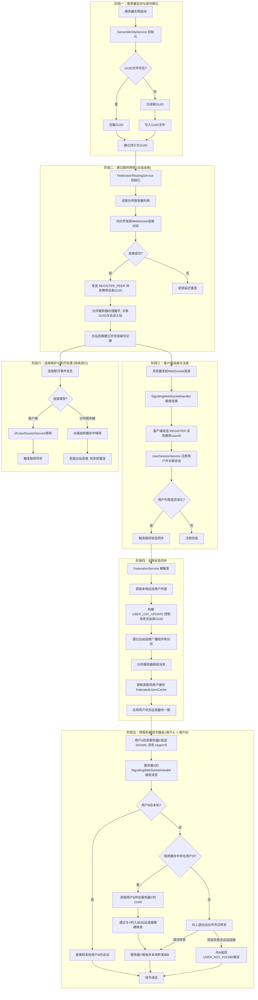

该流程图详细描绘了从服务器启动、联邦网络建立、客户端注册、全网状态同步，到最核心的跨服务器信令路由的全过程。

```mermaid
graph TD;
    %% --- 完整的WebChat后端联邦网络与信令流转流程图 --- %%
    
    subgraph "阶段一：服务器启动与身份确立"
        S1_Start[服务器实例启动] --> S1_Init[ServerIdentityService 初始化];
        S1_Init --> S1_CheckFile{GUID文件存在?};
        S1_CheckFile -- 是 --> S1_Load[加载GUID];
        S1_CheckFile -- 否 --> S1_Generate[生成新GUID];
        S1_Generate --> S1_Write[写入GUID文件];
        S1_Load --> S1_End[确立持久化GUID];
        S1_Write --> S1_End;
    end

    subgraph "阶段二：建立联邦网络 (出站连接)"
        S2_Start[FederationRoutingService 初始化] --> S2_ReadPeers[读取伙伴服务器列表];
        S2_ReadPeers --> S2_Connect[向伙伴发起WebSocket连接 出站];
        S2_Connect --> S2_CheckConn{连接成功?};
        S2_CheckConn -- 是 --> S2_Handshake[发送 REGISTER_PEER 消息携带自身GUID];
        S2_CheckConn -- 否 --> S2_Retry[安排延迟重连];
        S2_Handshake --> S2_PeerReceives[伙伴服务器处理握手, 关联GUID与会话入站];
        S2_PeerReceives --> S2_End[出站连接建立并完成身份交换];
    end

    subgraph "阶段三：客户端连接与注册"
        S3_Start[浏览器发起WebSocket连接] --> S3_HandleConn[SignalingWebSocketHandler 接收连接];
        S3_HandleConn --> S3_Register[客户端发送 REGISTER 消息携带UserID];
        S3_Register --> S3_UserService[UserSessionService 注册用户并关联会话];
        S3_UserService --> S3_CheckChange{用户列表是否变化?};
        S3_CheckChange -- 是 --> S3_TriggerSync[触发联邦状态同步];
        S3_CheckChange -- 否 --> S3_End[注册完成];
    end

    subgraph "阶段四：全网状态同步"
        S4_Start[FederationService 被触发] --> S4_GetLocalUsers[获取本地在线用户列表];
        S4_GetLocalUsers --> S4_BuildMsg[构建 USER_LIST_UPDATE 控制消息含自身GUID];
        S4_BuildMsg --> S4_Broadcast[通过出站连接广播给所有伙伴];
        S4_Broadcast --> S4_PeerReceives[伙伴服务器接收消息];
        S4_PeerReceives --> S4_UpdateCache[更新其联邦用户缓存 federatedUsersCache];
        S4_UpdateCache --> S4_End[全网用户状态达成最终一致];
    end

    subgraph "阶段五：跨服务器信令路由 (用户A -> 用户B)"
        S5_Start[用户A向其服务器X发送 SIGNAL 消息 target=B] --> S5_Receive[服务器X的SignalingWebSocketHandler接收消息];
        S5_Receive --> S5_CheckLocal{用户B在本机?};
        S5_CheckLocal -- 是 --> S5_ForwardLocal[直接转发给用户B的会话];
        S5_ForwardLocal --> S5_End[信令送达];
        S5_CheckLocal -- 否 --> S5_CheckCache{联邦缓存中存在用户B?};
        S5_CheckCache -- 是 --> S5_GetGuid[获取用户B所在服务器Y的GUID];
        S5_GetGuid --> S5_RoutePrecise[通过与Y的入站/出站连接精确转发];
        S5_CheckCache -- 否 --> S5_Flood[向上游出站伙伴洪泛转发];
        S5_RoutePrecise --> S5_ServerY[服务器Y接收并本地转发给B];
        S5_Flood -- 成功转发 --> S5_ServerY;
        S5_ServerY --> S5_End;
        S5_Flood -- 转发失败无出站连接 --> S5_NotFound[向A返回USER_NOT_FOUND错误];
        S5_NotFound --> S5_End;
    end
    
    subgraph "阶段六：连接维护与断开处理 (持续进行)"
        S6_Event[连接断开事件发生] --> S6_CheckType{连接类型?};
        S6_CheckType -- 客户端 --> S6_Client[从UserSessionService移除];
        S6_Client --> S6_TriggerSync[触发联邦同步];
        S6_CheckType -- 伙伴服务器 --> S6_Peer[从路由和缓存中移除];
        S6_Peer --> S6_Retry[若是出站连接, 则安排重连];
    end

    %% --- 阶段之间的逻辑流转 --- %%
    S1_End --> S2_Start;
    S2_End --> S3_Start;
    S3_TriggerSync --> S4_Start;
    S4_End --> S5_Start;
    
    %% --- 阶段六是事件驱动的，在网络建立后持续运行 --- %%
    S2_End --> S6_Event;
```